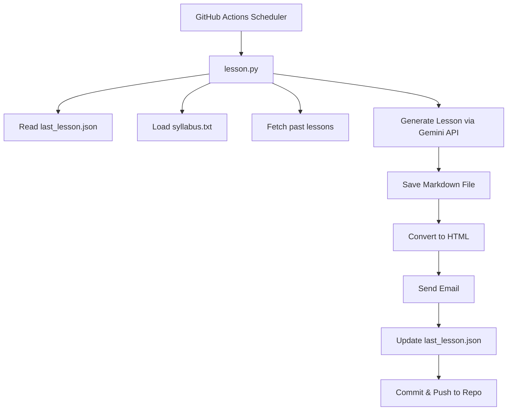
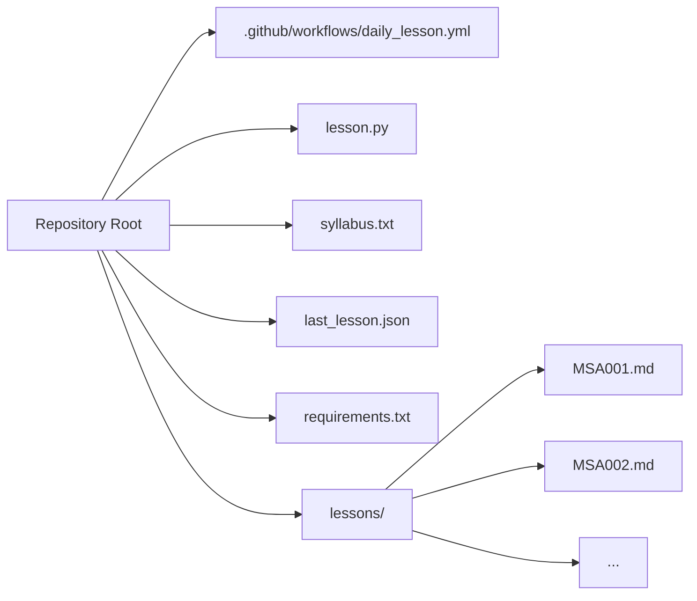
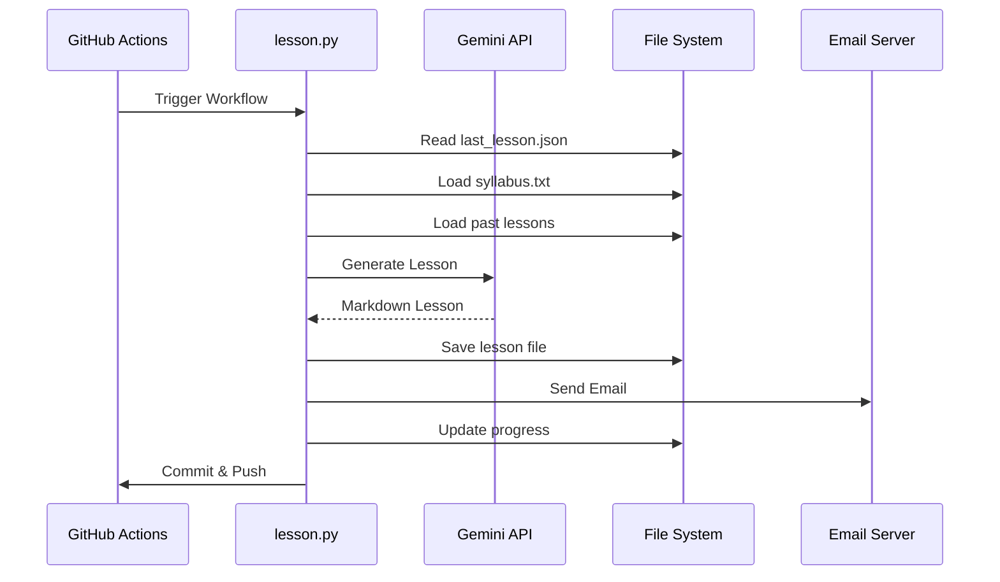

# 📘 Mudarris Al-Arab Agent (M365)

An automated **365-day Modern Standard Arabic (MSA) learning system** powered by AI.
This project generates **daily structured lessons**, stores them, and delivers them via email—fully hands-free using GitHub Actions.

---

## 🚀 Overview

**Mudarris365** is an intelligent Arabic teacher that:

* Generates **daily beginner-friendly lessons**
* Follows a **structured 365-day syllabus**
* Tracks learner progress
* Avoids overwhelming vocabulary
* Sends lessons directly to your inbox

Everything runs automatically using **GitHub Actions + Gemini AI**.

---

## 🧠 Core Features

### ✨ AI-Powered Lesson Generation

* Uses `gemini-2.5-flash`
* Context-aware (reads last 15 lessons)
* Strict pedagogy rules (beginner-first approach)

### 📆 Daily Automation

* Runs every day via GitHub Actions
* Fully autonomous after setup

### 📚 Structured Learning System

* 365-day syllabus progression
* Gradual vocabulary introduction
* Reinforced learning through repetition

### 📩 Email Delivery

* Sends beautifully styled HTML lessons
* Mobile-friendly formatting

### 💾 Progress Tracking

* Stores last completed day
* Prevents duplication or skipping

### 🧾 Markdown + HTML Output

* Saves lessons as `.md`
* Converts to styled HTML for email

---

## 📂 Project Structure



---

### 📁 File Layout



---

## ⚙️ How It Works

### 1. Scheduler Trigger

* Runs daily at:

  ```
  10:30 PM UTC (4:00 AM IST)
  ```

### 2. Lesson Pipeline

1. Read last completed day
2. Determine today's topic
3. Load recent lesson context
4. Generate lesson via AI
5. Save lesson file
6. Send email
7. Update progress
8. Commit changes

---

## 📖 Lesson Format

Each lesson strictly follows:

```md
# Topic Title

## Lesson
Explanation in simple English

## Examples
Beginner-friendly examples

## Practice
Exercises for reinforcement

## 📚 Core Vocabulary
(Only today's learned items)

## 🗣️ Key Sentences
(Only if readable by student)
```

---

## 🔐 Environment Variables (Secrets)

Set these in GitHub:

| Variable             | Description        |
| -------------------- | ------------------ |
| `GEMINI_API_KEY`     | Google AI API Key  |
| `GMAIL_USER`         | Sender email       |
| `GMAIL_APP_PASSWORD` | Gmail App Password |
| `TO_EMAIL`           | Recipient email    |

---

## 🛠️ Setup Instructions

### 1. Clone Repo

```bash
git clone https://github.com/your-repo/mudarris365.git
cd mudarris365
```

### 2. Install Dependencies

```bash
pip install -r requirements.txt
```

### 3. Configure Secrets

Add in GitHub → Settings → Secrets

### 4. Enable Actions

Ensure GitHub Actions is enabled

---

## 📦 Dependencies

* `google-generativeai`
* `markdown`
* `smtplib` (built-in)
* `email` (built-in)

---

## 🤖 Workflow Automation



---

## 🎯 Learning Philosophy

* 👶 Teach like a **first-grade student**
* 🚫 No unnecessary vocabulary
* 🔁 Reinforce previous knowledge
* 🔤 Gradual Arabic exposure
* 📈 Progressive difficulty

---

## 📅 Example Progression

| Day | Topic                 |
| --- | --------------------- |
| 1   | Arabic Alphabet       |
| 2   | Harakat (Vowels)      |
| 3   | Sun & Moon Letters    |
| ... | ...                   |
| 365 | Advanced Conversation |

---

## 🔄 Customization Options

You can easily modify:

* `syllabus.txt` → Change curriculum
* `lesson.py` → Adjust teaching style
* Email styling → Modify HTML template
* Schedule → Edit cron in workflow

---

## 🧩 Advanced Features (Built-in)

* Retry logic for API failures
* Context-limited memory (last 15 lessons)
* Auto file versioning
* Safe commits (no empty commits)
* Clean markdown formatting
* Styled email templates

---

## 🛡️ Reliability Design

* ✅ Retry mechanism (3 attempts)
* ✅ Safe fallback topics
* ✅ State persistence
* ✅ Idempotent commits

---

## 📬 Example Output

* File: `lessons/MSA057.md`
* Email Subject:

  ```
  Mudarris 365 - Topic Name
  ```

---

## 🤝 Contribution

Want to improve it?

* Add better prompts
* Expand syllabus
* Improve UI/email styles
* Add web dashboard

---

## 📜 License

MIT License

---

## 🌟 Future Enhancements

* 🌐 Web dashboard (progress tracking)
* 📊 Analytics (learning insights)
* 🔊 Audio pronunciation
* 📱 Mobile app integration
* 🧠 Spaced repetition system

---

## 💡 Final Note

This isn’t just automation—it’s a **full AI-powered Arabic learning system** that grows with the learner every single day.

---

